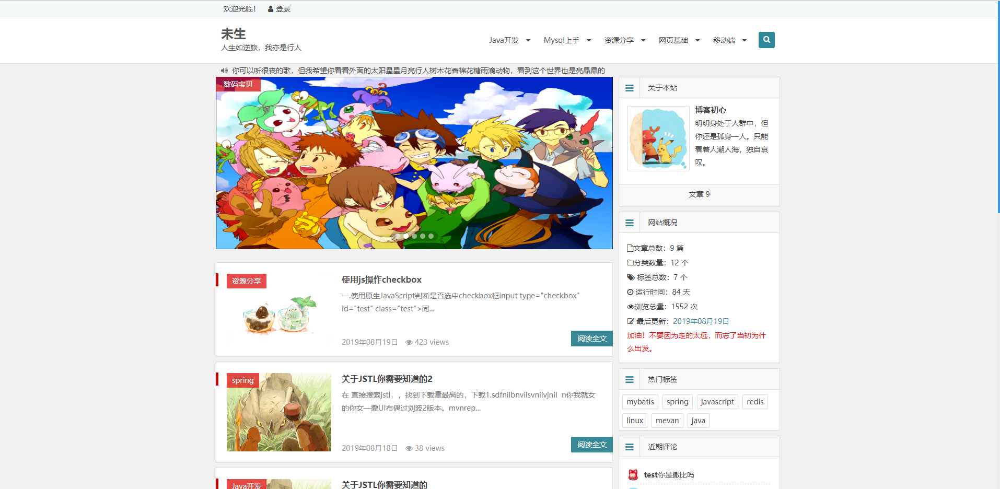
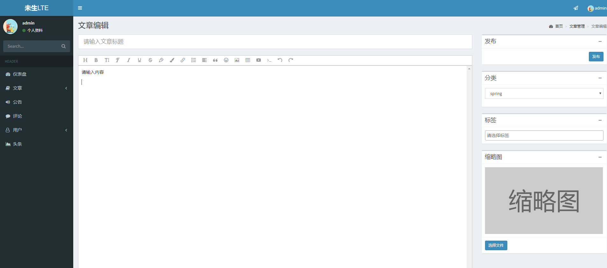

#个人博客
导入blog.sql，修改yml配置文件，把邮箱账号密码改成自己的，yml中设置自己的图片上传目录,MyMvcConfig.java也需要更改导入之后数据库应该是没有图片的。
项目主页：http://localhost/blog/index

SpringBoot + Mybatis进行开发。后台界面使用的adminLTE管理模板，基本完成个人博客需要的功能。
能够使用分类，标签，完成筛选功能
## 主页面
主页面复制言曌博客主界面

[言曌博客](http://blog.liuyanzhao.com/)

## 后台界面 
